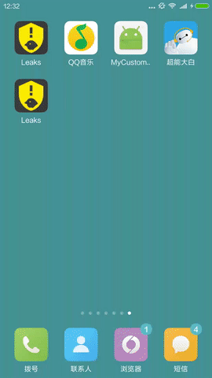

## MySnackBar
从顶部弹出的Snackbar,用于提示用户操作信息.
提供三种信息: SUCCESS,WARNING,ERROR

## ScreenShot
4.4之上<br>


<br>4.4以下<br>
```
4.4以下比较特殊没有覆盖到状态栏，只能覆盖actionBar，正在想办法
```

## Example
 first add dependences
```
  dependencies {
    compile 'com.trycatch.android:mysnackbar:1.1.11'
  }
```

## use
```
    public class MainActivity extends BaseActivity {
        private TSnackbar snackBar;
        private Handler mHandler = new Handler() {
            @Override
            public void handleMessage(Message msg) {
                // TODO Auto-generated method stub
                super.handleMessage(msg);
                switch (msg.what) {
                    case 0:
                        if(snackBar!=null){
                            snackBar.setPromptThemBackground(Prompt.SUCCESS).setText("登录成功").setDuration(TSnackbar.LENGTH_LONG).show();
    
                        }
                        break;
                    case 1:
                        if(snackBar!=null) {
                            snackBar.setPromptThemBackground(Prompt.ERROR).setText("登录失败").setDuration(TSnackbar.LENGTH_LONG).show();
                        }
                        break;
                    default:
                        break;
                }
            }
        };;
        Runnable gotoLoginActSuccess = new Runnable() {
            @Override
            public void run() {
                Message msg = new Message();
                msg.what = 0;
                mHandler.sendMessage(msg);
            }
        };
        Runnable gotoLoginActFail = new Runnable() {
            @Override
            public void run() {
                Message msg = new Message();
                msg.what = 1;
                mHandler.sendMessage(msg);
            }
        };
        @Override
        protected void onCreate(Bundle savedInstanceState) {
            super.onCreate(savedInstanceState);
            setContentView(R.layout.activity_main);
        }
        public void onClick(View v) throws InterruptedException {
            final ViewGroup viewGroup = (ViewGroup) findViewById(android.R.id.content).getRootView();
            switch (v.getId()) {
                case R.id.success:
                    snackBar = TSnackbar.make(viewGroup, "成功...", TSnackbar.LENGTH_SHORT, TSnackbar.APPEAR_FROM_TOP_TO_DOWN);
                    snackBar.setAction("取消", new View.OnClickListener() {
                        @Override
                        public void onClick(View v) {
    
                        }
                    });
                    snackBar.setPromptThemBackground(Prompt.SUCCESS);
                    snackBar.show();
                    break;
                case R.id.error:
                    snackBar = TSnackbar.make(viewGroup, "错误...", TSnackbar.LENGTH_LONG, TSnackbar.APPEAR_FROM_TOP_TO_DOWN);
                    snackBar.addIcon(R.mipmap.ic_launcher,100,100);
                    snackBar.setAction("取消", new View.OnClickListener() {
                        @Override
                        public void onClick(View v) {
    
                        }
                    });
                    snackBar.setPromptThemBackground(Prompt.ERROR);
                    snackBar.show();
                    break;
                case R.id.warning:
                    snackBar = TSnackbar.make(viewGroup, "警告...", TSnackbar.LENGTH_LONG, TSnackbar.APPEAR_FROM_TOP_TO_DOWN);
                    snackBar.addIcon(R.mipmap.ic_launcher,100,100);
                    snackBar.setAction("取消", new View.OnClickListener() {
                        @Override
                        public void onClick(View v) {
    
                        }
                    });
                    snackBar.setPromptThemBackground(Prompt.WARNING);
                    snackBar.show();
                    break;
                case R.id.loginSuccess:
                    snackBar = TSnackbar.make(viewGroup, "正在登录，请稍后...", TSnackbar.LENGTH_INDEFINITE, TSnackbar.APPEAR_FROM_TOP_TO_DOWN);
                    snackBar.setAction("取消", new View.OnClickListener() {
                        @Override
                        public void onClick(View v) {
    
                        }
                    });
                    snackBar.setPromptThemBackground(Prompt.SUCCESS);
                    snackBar.addIconProgressLoading(0,true,false);
                    snackBar.show();
                    mHandler.postDelayed(gotoLoginActSuccess, 5000);
                    break;
                case R.id.loginFail:
                    snackBar = TSnackbar.make(viewGroup, "正在登录，请稍后...", TSnackbar.LENGTH_INDEFINITE, TSnackbar.APPEAR_FROM_TOP_TO_DOWN);
                    snackBar.setAction("取消", new View.OnClickListener() {
                        @Override
                        public void onClick(View v) {
    
                        }
                    });
                    snackBar.setPromptThemBackground(Prompt.SUCCESS);
                    snackBar.addIconProgressLoading(0,true,false);
                    snackBar.show();
                    mHandler.postDelayed(gotoLoginActFail, 5000);
                    break;
                default:
                    
            }
        }
    
        @Override protected void onDestroy() {
            super.onDestroy();
            
        }
    }
    
```


## Thanks To
<a href="https://github.com/hongyangAndroid/ColorfulStatusBar" target="_blank">ColorfulStatusBar</a>
<br>
<a href="https://github.com/google/iosched" target="_blank">iosched</a>
<a href="https://github.com/baiiu/TSnackbar">baiiu</>

## License

```
Copyright 2015 baiiu

Licensed under the Apache License, Version 2.0 (the "License");
you may not use this file except in compliance with the License.
You may obtain a copy of the License at

   http://www.apache.org/licenses/LICENSE-2.0

Unless required by applicable law or agreed to in writing, software
distributed under the License is distributed on an "AS IS" BASIS,
WITHOUT WARRANTIES OR CONDITIONS OF ANY KIND, either express or implied.
See the License for the specific language governing permissions and
limitations under the License.
```